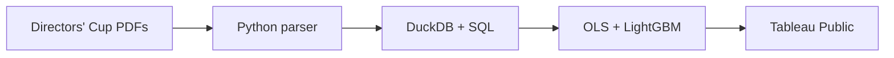

# The Swoosh Effect

A reproducible study of apparel sponsorship and all-sport NCAA Division I performance: does Nike pick winners or make them?

[](https://github.com/alexandrajcowan275/swoosh-effect/actions/workflows/ci.yml) [](LICENSE)

[Tableau dashboard](https://public.tableau.com/views/TheSwooshEffect/TheSwooshEffect) · [LinkedIn](https://www.linkedin.com/in/alexandra-cowan-24705331b/)

## Why I built this

I only wanted to row for a Nike school. That preference made me test whether Nike schools actually win more, using results across entire athletic departments.

## Key findings

- **The best programs wear Nike (A+B):** Top-10 finish rates are **21.1% for Nike (61/289 school-seasons)**, **3.5% for Under Armour (3/86)**, **2.4% for adidas (2/85)** and **0.0% for other verified providers (0/7)**. These are within-brand rates. [Source](reports/brand_summary.csv).
- **Pick or make (A+B):** Adding prior-season performance shrinks Nike-relative adidas/Under Armour coefficient magnitudes by **56–62%** on identical samples. Consistent with selection/persistence, not proof of causation. [Source](reports/lag_attenuation.csv).
- **ML benchmark (all-school holdout; pre-season A+B brand evidence):** Prior performance ranks **#1 of 43 features**. No model consistently beats the last-season baseline across MAE and RMSE: MAE is **11.08 baseline**, **11.12 OLS** and **11.18 LightGBM**, across **712 school-seasons**. OLS and LightGBM improve RMSE. [Metrics](reports/ml/metrics.csv) · [Importance](reports/ml/permutation_importance.csv).


## How it works



| Layer | Tools | Purpose |
|---|---|---|
| Parsing | Python, pdfplumber | Extract and validate standings |
| Data | pandas, DuckDB, SQL | Join school-seasons and audit evidence |
| Statistics | statsmodels | Compare brands with clustered OLS and performance lags |
| ML | LightGBM, scikit-learn | Forecast with time-based validation and permutation importance |
| Delivery | pytest, GitHub Actions, Docker, Tableau | Test, reproduce and explore results |

## Quickstart

From a cloned repository. Local prerequisites: **Python 3.12** and an OpenMP runtime (`libomp` on macOS, `libgomp1` on Linux); Docker includes both. [Setup and full PDF rebuild](docs/methodology.md#how-to-run).

**Local — rebuild from committed, audited CSVs and run all tests:**

```bash
python3.12 -m venv .venv
.venv/bin/python -m pip install -r requirements.txt
PYTHON=.venv/bin/python ./run.sh --offline
```

**Docker — with a running Docker engine:**

```bash
docker build -t swoosh-effect .
docker run --rm --network none swoosh-effect
```

## Methodology & limitations

- The selected department cohort is not a D1 census; brand rates are not national market shares. [Scope and sources](docs/data_sources.md).
- A+B means direct evidence; the separate A+B+C analysis adds bounded continuity inference. Unknown brands stay unknown. [Evidence rules](docs/methodology.md#evidence-and-coverage).
- Observational models cannot establish causation; budgets, sport offerings and prior provider exposure can confound results. [Models](docs/methodology.md#models-and-sample-sizes).
- Forecasts use time-based splits and pre-season inputs. Masked brands and historical source revisions limit interpretation. [ML methods](docs/methodology.md#machine-learning-benchmark).
- COVID, realignment and coaching changes complicate switch case studies. [Full limitations](docs/methodology.md#limitations-and-remaining-unknowns) · [Release audit](docs/release_audit.md) · [Number ledger](docs/readme_number_ledger.csv).

## Repo structure

```text
.github/   CI tests and publication checks
data/      Audited observations, evidence and source manifests
src/       Parsers, handwritten algorithms, statistical models and ML
sql/       Database views and descriptive summaries
scripts/   Secret/URL checks and synthetic fixture utilities
tests/     Parser, evidence, regression, forecasting and security checks
reports/   Generated findings, charts and model outputs
exports/   Tableau-ready CSVs and data dictionary
docs/      Methodology, data sources, dashboard guide and audit records
notebooks/ Exploratory analysis
```

Independent student project. Not affiliated with or endorsed by Nike, Inc.
