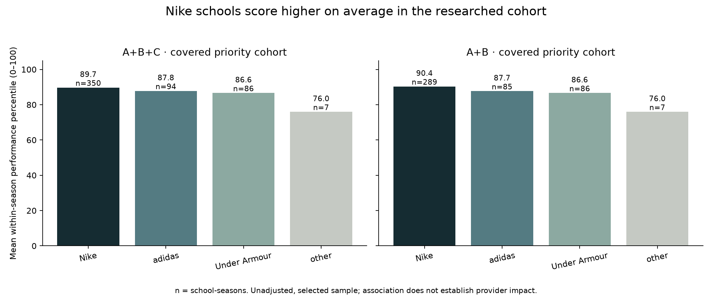
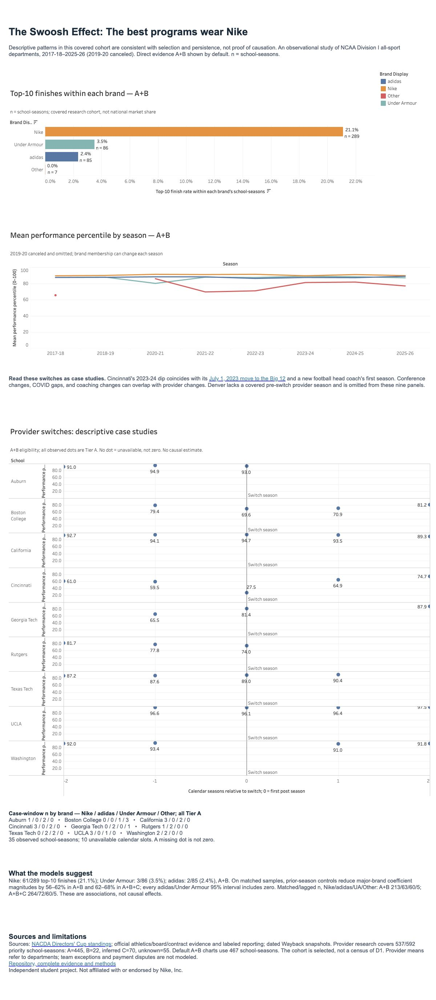
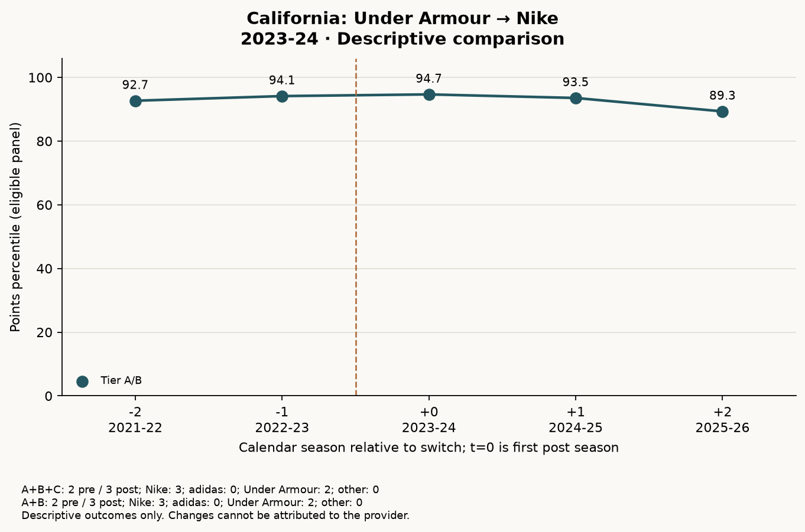

# The Swoosh Effect

[](https://github.com/alexandrajcowan275/swoosh-effect/actions/workflows/ci.yml)

A reproducible study of apparel providers and all-sport NCAA Division I athletic-department performance: does Nike pick winners or make them?

## TL;DR

**The best programs wear Nike.** Descriptive patterns in this covered cohort are consistent with selection and persistence, not proof of causation. Nike schools finish in the national top 10 more often within this study's covered school-seasons. Using direct evidence only (A+B):

| Department provider | Top-10 finishes / school-seasons | Top-10 finish rate | Mean performance percentile |
|---|---:|---:|---:|
| Nike | 61 / 289 | **21.1%** | 90.36 |
| Under Armour | 3 / 86 | 3.5% | 86.64 |
| adidas | 2 / 85 | 2.4% | 87.69 |
| Other verified provider | 0 / 7 | 0.0% | 75.97 |

These are rates within each brand's school-seasons, **not national market shares**. Nike's unadjusted mean percentile exceeds adidas by **2.67 points** and Under Armour by **3.72 points** in A+B. In A+B+C, those gaps are 1.90 and 3.09 points.

After holding the sample constant, adding prior-season performance reduces the adjusted adidas/Under Armour coefficient magnitudes by **56–62% in A+B** and **62–68% in A+B+C**. This attenuation is a comparison of regression coefficients, not a percentage reduction in the raw mean gaps. Every adidas and Under Armour 95% confidence interval includes zero in the plain and lagged models.

The pattern is **consistent with Nike signing already-elite programs and performance persisting across seasons**. It does not prove a signing strategy or a causal effect of the provider. Brand comparisons and the lagged model are the headline findings; switch histories provide descriptive context.



Numbers come from [brand_summary.csv](reports/brand_summary.csv) and [model_coefficients.csv](reports/model_coefficients.csv). All outcomes are department-level Directors' Cup performance across sports; rowing is an optional supporting cut.

## Interactive dashboard

[Explore the published Tableau Public dashboard](https://public.tableau.com/views/TheSwooshEffect/TheSwooshEffect) for top-10 finish rates, performance trends by brand, and nine descriptive switch case studies. The dashboard uses direct evidence (A+B).

[](https://public.tableau.com/views/TheSwooshEffect/TheSwooshEffect)

## Models and sample sizes

The plain model controls for conference and season. The lagged model additionally controls for the previous calendar season's percentile. Standard errors cluster by school; 95% confidence intervals use a small-sample correction and cluster-based t degrees of freedom. Nike is the reference brand, so coefficients below are percentile-point differences relative to Nike.

| Evidence / model | adidas coefficient [95% CI] | Under Armour coefficient [95% CI] | n Nike / adidas / UA / other |
|---|---:|---:|---:|
| A+B+C plain | −3.09 [−6.58, 0.40] | −2.53 [−5.67, 0.60] | 350 / 94 / 86 / 7 |
| A+B+C plain, matched sample | −2.86 [−6.41, 0.69] | −1.75 [−4.71, 1.22] | 264 / 72 / 60 / 5 |
| A+B+C lagged | −0.92 [−2.65, 0.80] | −0.66 [−2.38, 1.07] | 264 / 72 / 60 / 5 |
| A+B plain | −3.48 [−6.98, 0.02] | −2.95 [−6.18, 0.28] | 289 / 85 / 86 / 7 |
| A+B plain, matched sample | −3.29 [−6.83, 0.25] | −2.26 [−5.37, 0.86] | 213 / 63 / 60 / 5 |
| A+B lagged | −1.26 [−3.18, 0.66] | −0.99 [−2.90, 0.92] | 213 / 63 / 60 / 5 |

Here, **n counts school-seasons**. The full plain models contain 73 distinct schools; the matched and lagged models contain 72. The lagged sample totals are 401 (A+B+C) and 341 (A+B). Coefficient attenuation compares each lagged model with its matched-sample plain model: 67.7%/62.3% for adidas/UA in A+B+C, and 61.7%/56.2% in A+B. The canceled 2019-20 season is never bridged when constructing a one-year lag.

[Full analysis report](reports/phase3_analysis.html) · [Model sample sizes](reports/model_sample_sizes.csv) · [Model diagnostics](reports/model_diagnostics.csv)

## Switch case studies

Ten documented transitions use windows of up to ±2 calendar seasons, with the switch season treated as the first post season. Nine have at least one covered pre and post observation under both evidence definitions. Denver is not usable for a before/after comparison because its former provider lacks covered pre-switch evidence. All included switch-window observations are Tier A; the two evidence definitions therefore give the same case-study samples.



California's chart contains two Under Armour and three Nike school-seasons, all Tier A. Its 2023-24 provider change overlaps with a men's basketball coaching change, and its ACC move follows in 2024-25. These are descriptive case studies, with no causal claims.

Cincinnati's percentile fell from **59.50 in 2022-23 to 27.53 in 2023-24** (one Under Armour and one Nike school-season, both Tier A). The dip coincided with its [July 1, 2023 move to the Big 12](https://gobearcats.com/news/2022/06/10/cincinnati-to-enter-big-12-on-july-1-2023), its provider switch, and a new football head coach's first season. The [confounder table](reports/switch_case_confounders.csv) records the source and dates; this overlap prevents a provider-only interpretation.

[All switch charts](reports/switch_case_studies.html) · [Usability and n per brand](reports/switch_case_summary.csv) · [Underlying observations](reports/switch_case_observations.csv)

## Machine-learning benchmark

Can a CPU gradient-boosted tree model forecast the next season better than persistence? The [LightGBM benchmark](reports/ml/README.md) trains on **1,413 school-seasons** and holds out **2024-25 and 2025-26: 712 school-seasons across 356 schools**. Four small configurations are tuned only through rolling-origin validation on earlier seasons. Features include exact-calendar percentile lags, prior-season sport scores and conference, pre-season dated brand evidence, and a known season trend. No same-season performance enters the predictors.

| Held-out model | MAE [95% CI] | RMSE [95% CI] |
|---|---:|---:|
| Last-season percentile | **11.08** [10.17, 12.01] | 15.66 [14.56, 16.72] |
| Predictive lagged OLS | 11.12 [10.38, 11.86] | **14.40** [13.52, 15.25] |
| LightGBM | 11.18 [10.42, 11.95] | 14.58 [13.67, 15.47] |

Errors are percentile points; CIs use 2,000 paired school-cluster bootstrap resamples. LightGBM improves RMSE over the naive baseline by **1.08 points** (paired difference −1.08, 95% CI [−1.64, −0.49]), but does **not** improve MAE (difference +0.10, CI [−0.40, 0.61]). OLS has the lowest RMSE; the naive baseline has the lowest MAE. The tree ensemble does not dominate these simpler models.

Prior-season percentile ranks **1st of 43 features** by within-season held-out permutation importance; the two-season lag ranks 2nd. Brand is tied at **22nd**, with zero measured importance, and the independently tuned no-brand model produces identical predictions. This limited brand test uses only **51 dated pre-season assignments** in the holdout (Nike 32, adidas 12, Under Armour 5, other 2; all Tier A); **661 rows have masked/unknown brand**. It does not show that brands generally have no effect. Tier C and late/undated evidence are excluded from ML brand inputs while the original research analyses retain their stated A+B+C/A+B samples.

The predictive OLS replaces retrospective season fixed effects with a linear calendar trend, since an unseen future season has no estimable fixed effect. The model is frozen before both test seasons, while each one-step prediction can use observed prior-season results. Historical source values and URL-derived publication dates are proxies, not a fully versioned as-of archive. [Full methods and limitations](reports/ml/README.md) · [Metrics and CIs](reports/ml/metrics.csv) · [Permutation importance](reports/ml/permutation_importance.csv) · [Rolling validation](reports/ml/rolling_cv.csv)

## How to run

Requires **Python 3.12**, a shell, internet access for the first PDF download, and an OpenMP runtime for LightGBM (`libomp` on macOS or `libgomp1` on Linux; the Docker image includes it). From the repository root, run these three commands:

```bash
python3.12 -m venv .venv
.venv/bin/python -m pip install -r requirements.txt
PYTHON=.venv/bin/python ./run.sh
```

`run.sh` downloads missing Directors' Cup PDFs from the recorded source URLs, verifies their SHA-256 checksums, rebuilds the tables and local DuckDB database, regenerates the analysis, Tableau exports and ML benchmark, and runs the full pytest suite. No API key is needed. PDF files, the database, caches, and virtual environments stay outside Git. If a source cannot be downloaded, use its `source_url` or `landing_url` in the manifests below, save it to the listed `file` path, and rerun; the checksum must match the recorded source version.

CI runs the full test suite on Python 3.12.14 using committed synthetic PDF fixtures and audited CSVs, with network calls blocked during tests. It never downloads the 24 source PDFs. Both the pre-commit checks and a full-history secret scan run on every push and pull request.

To rerun only the ML experiment after installing dependencies, run `.venv/bin/python -m src.ml_benchmark`.

To enable the publication checks for future commits, run `.venv/bin/pre-commit install`. The pinned hooks scan for secrets and tokenized URLs; pytest also checks tracked files for tokenized URLs.

## Run with Docker

Requires a running Docker engine. Build and run the full analysis pipeline and test suite in two commands:

```bash
docker build -t swoosh-effect .
docker run --rm --network none swoosh-effect
```

The pinned Python 3.12.14 slim image installs exact dependency versions and runs as UID 10001. The default `--offline` mode rebuilds combined sport tables, DuckDB, statistical reports, Tableau exports and the ML benchmark from the committed audited CSVs, then runs all tests. Network access is disabled during the run; the 24 source PDFs are not downloaded or included in the image. Outputs stay inside the disposable container. The host Git history, credentials, caches, virtualenvs, and `/site` are excluded from the build context. A fresh container-only Git index lets publication checks inspect the packaged files without carrying host history.

For a full raw-source rebuild, run the image with `./run.sh` and network access, or use the Python instructions above. On this Mac's isolated Colima profile, add `--context colima-swoosh` after `docker` in both commands. The same offline mode is available locally as `PYTHON=.venv/bin/python ./run.sh --offline`.

## Numerical reproducibility

Counts, provider assignments and evidence tiers must agree exactly. Floating-point results are compared with an absolute tolerance of **1e-9** (in the reported units) and zero relative tolerance; this allows harmless serialization and numerical-library differences. Earlier algorithm regression checks retain their tighter 1e-12 threshold. README model values use two decimals, finish rates use one decimal, and Tableau expected values use six decimals. Input hashes describe exact file bytes and can change after an equivalent CSV reserialization; figure timestamps and metadata are not numerical findings.

## Evidence and coverage

The study includes eight completed seasons from **2017-18 through 2025-26**, excluding canceled 2019-20. Sponsor research prioritizes 74 schools: the 68 appearing in the four power conferences in the 2025-26 standings and six other schools with a top-50 finish during the window. Coverage is **537 of 592 priority school-seasons (90.7%)**.

| Evidence tier | School-seasons | Assignment rule |
|---|---:|---|
| A | 445 | Contract, board record, official announcement, or accepted reporting of contract terms; source type is labeled |
| B | 22 | Dated official evidence of use in that season, including official guides/releases or archived athletics pages |
| C | 70 | Inferred continuity: the same brand has A/B evidence on both sides, with no known intervening switch |
| Unknown | 55 | Insufficient evidence; excluded from brand models |

**Primary analysis uses A+B+C; sensitivity analysis uses A+B (467 school-seasons).** C cannot fill a window endpoint, cross a known transition, or anchor another inference. Source URLs, archive snapshot URLs, snapshot dates, source types, and inference anchors remain traceable in the [season evidence table](data/processed/sponsor_seasons.csv) and [coverage table](reports/sponsor_coverage.csv). Raw archived webpages and search logs are not republished.

The analysis unit is the department's primary provider. Team exceptions are documented, not separately modeled. Transition seasons use the provider covering the majority of competition, with effective or announcement dates labeled. Payment disputes do not change provider assignments and do not establish that payments continued.

The underlying performance panel contains **2,833 school-seasons**: 2,395 published final-standing observations plus **438 retained D1 zero rows**. The membership audit reviewed 469 proposed zeros and dropped **31** for seasons before D1 entry or after departure/closure. [Membership review](data/division_i_membership_review.csv) · [Zero-row audit](reports/zero_row_audit.csv)

## Data sources and outputs

- **Directors' Cup standings:** [NACDA's standings archive](https://nacda.com/sports/2018/7/17/directorscup-nacda-directorscup-previous-standings-html.aspx). The [eight final-source records](data/sources.json) and [sixteen fall/winter records](data/seasonal_sources.json) retain canonical PDF URLs, landing URLs, retrieval dates, filenames, and SHA-256 hashes. PDFs are downloaded locally rather than redistributed in this repository.
- **Provider evidence:** official athletics announcements, board records, contract documents, dated guides, and labeled secondary reporting in [sponsor_evidence.json](data/sponsor_evidence.json). Archived official-page evidence links to the [Internet Archive's Wayback Machine](https://web.archive.org/), with snapshot dates retained in the evidence tables. The [research report](reports/sponsor_research.html) explains decisions and unresolved gaps.
- **Transition context:** official athletics releases cited in [switch_confounders.json](data/switch_confounders.json) and the [confounder table](reports/switch_case_confounders.csv).
- **Analysis-ready exports:** [school_season.csv](exports/tableau/school_season.csv), [brand_summary.csv](exports/tableau/brand_summary.csv), and [switch_events.csv](exports/tableau/switch_events.csv), with a [data dictionary](exports/tableau/README.md). Unknown providers remain visible in the full export.
- **Rebuildable analysis:** [Python pipeline](src/), [SQL summaries](sql/descriptive_summaries.sql), [analysis notebook](notebooks/analysis.ipynb), and [validation outputs](reports/). An additional Jupyter/IPython environment is only needed to execute the notebook interactively.

`src/algorithms.py` implements interval merging and dynamic-programming Levenshtein distance by hand. Interval logic enforces the Tier C boundaries; name matching gives reviewed aliases precedence and sends ambiguous matches to manual review. Tests cover algorithm edge cases, parser/source checks, evidence rules, regression baselines, model samples, and export reconciliation.

## Limitations and remaining unknowns

- **Scope and selection:** neither the 74-school sponsor cohort nor the 358 institutions observed at least once in the final standings is a census of all D1 institutions. Brand rates cannot establish national market share. Providers outside the research scope remain unresearched.
- **Missing evidence:** 55 priority school-seasons remain unknown, across 11 schools; 70 covered seasons use explicitly inferred Tier C continuity. Research was stopped at the agreed 90% coverage threshold. Contract amendments, every team exception, and uninterrupted payments have not been exhaustively verified.
- **Observational models:** budgets, sport offerings, and other advantages are omitted. There are no school fixed effects or athletic-revenue robustness models. Prior performance may itself reflect earlier provider exposure. The lagged `other` category is only Boston College (five school-seasons), so its coefficient is not generalizable to other providers.
- **Outcome definition:** performance percentiles are recalculated within the eligible observed-ever panel each season, including audited zeros. They are distinct from scoring-school-only percentiles in the source tables. COVID disruption and changing Directors' Cup scoring rules complicate comparisons across seasons.
- **Sport detail:** annual official totals remain authoritative. Four missing seasonal rows with nonzero final subtotals, five upward revisions, unresolved year-end exclusions, and small rounding differences limit sport-level contribution analysis. Three overflow cells are explicitly derived from published subtotals. See [source discrepancies](reports/source_discrepancies.csv) and [period reconciliation](reports/period_reconciliation.csv); do not sum the combined sport-observation file to reconstruct annual totals.
- **Switch context:** conference moves, COVID gaps, and coaching changes overlap with provider changes. The coaching screen targets football and basketball leadership, not every coach in every sport. A missing identified confounder does not establish that none occurred.

## Links

- [Tableau Public dashboard](https://public.tableau.com/views/TheSwooshEffect/TheSwooshEffect)
- [Analysis report](reports/phase3_analysis.html)
- [Provider evidence audit](reports/sponsor_research.html)
- [Tableau export dictionary](exports/tableau/README.md)

## License

Original project code is released under the [MIT License](LICENSE). Third-party source documents and data retain their respective owners' rights; source links and attribution are provided above. Downloaded source PDFs and archived third-party webpages are not included in Git.

Independent student project. Not affiliated with or endorsed by Nike, Inc.
